# F1 Race Replay 🏎️ 🏁

A Python application for visualizing Formula 1 race telemetry and replaying race events with interactive controls and a graphical interface.


> **HUGE NEWS:** The telemetry stream feature is now in a usable state. See the [telemetry demo documentation](./telemetry.md) for access instructions, data format details, and usage ideas.

## 📸 Screenshots

<details>
<summary>Telemetry Viewer</summary>

Live telemetry dashboard and HUD:


</details>


## Features

- **Race Replay Visualization:** Watch the race unfold with real-time driver positions on a rendered track.
- **Leaderboard:** See live driver positions and current tyre compounds.
- **Lap & Time Display:** Track the current lap and total race time.
- **Driver Status:** Drivers who retire or go out are marked as "OUT" on the leaderboard.
- **Interactive Controls:** Pause, rewind, fast forward, and adjust playback speed using on-screen buttons or keyboard shortcuts.
- **Legend:** On-screen legend explains all controls.
- **Driver Telemetry Insights:** View speed, gear, DRS status, and current lap for selected drivers when selected on the leaderboard.

## Controls

- **Pause/Resume:** SPACE or Pause button
- **Rewind/Fast Forward:** ← / → or Rewind/Fast Forward buttons
- **Playback Speed:** ↑ / ↓ or Speed button (cycles through 0.5x, 1x, 2x, 4x)
- **Set Speed Directly:** Keys 1–4
- **Restart**: **R** to restart replay
- **Toggle DRS Zone**: **D** to hide/show DRS Zone
- **Toggle Progress Bar**: **B** to hide/show progress bar
- **Toggle Driver Names**: **L** to hide/show driver names on track
- **Select driver/drivers**: Click to select driver or shift click to select multiple drivers


## Qualifying Session Support (in development)

Recently added support for Qualifying session replays with telemetry visualization including speed, gear, throttle, and brake over the lap distance. This feature is still being refined.

## Requirements

- Python 3.11+
- [FastF1](https://github.com/theOehrly/Fast-F1)
- [Arcade](https://api.arcade.academy/en/latest/)
- numpy

Install dependencies:
```bash
pip install -r requirements.txt
```

FastF1 cache folder will be created automatically on first run. If it is not created, you can manually create a folder named `.fastf1-cache` in the project root.

## Environment Setup

To get started with this project locally, you can follow these steps:

1. **Clone the Repository:**
   ```bash
   git clone https://github.com/IAmTomShaw/f1-race-replay
    cd f1-race-replay
    ```
2. **Create a Virtual Environment:**
    This process differs based on your operating system.
    - On macOS/Linux:
      ```bash
      python3 -m venv venv
      source venv/bin/activate
      ```
    - On Windows:
      ```bash
      python -m venv venv
      .\venv\Scripts\activate
      ```
3. **Install Dependencies:**
    ```bash
    pip install -r requirements.txt
    ```

4. **Run the Application:**
    You can now run the application using the instructions in the Usage section below.

## Usage

**DEFAULT GUI MENU:** To use the new GUI menu system, you can simply run:
```bash
python main.py
```


This will open a graphical interface where you can select the year and round of the race weekend you want to replay. This is still a new feature, so please report any issues you encounter.

**OPTIONAL CLI MENU:** To use the CLI menu system, you can simply run:
```bash
python main.py --cli
```


This will prompt you with series of questions and a list of options to make your choice from using the arrow keys and enter key.

If you would already know the year and round number of the session you would like to watch, you run the commands directly as follows:

Run the main script and specify the year and round:
```bash
python main.py --viewer --year 2025 --round 12
```

To run without HUD:
```bash
python main.py --viewer --year 2025 --round 12 --no-hud
```

To run a Sprint session (if the event has one), add `--sprint`:
```bash
python main.py --viewer --year 2025 --round 12 --sprint
```

The application will load a pre-computed telemetry dataset if you have run it before for the same event. To force re-computation of telemetry data, use the `--refresh-data` flag:
```bash
python main.py --viewer --year 2025 --round 12 --refresh-data
```

### Qualifying Session Replay

To run a Qualifying session replay, use the `--qualifying` flag:
```bash
python main.py --viewer --year 2025 --round 12 --qualifying
```

To run a Sprint Qualifying session (if the event has one), add `--sprint`:
```bash
python main.py --viewer --year 2025 --round 12 --qualifying --sprint
```

## File Structure

```bash
f1-race-replay/
├── main.py                                 # Entry point
├── requirements.txt                        # Python dependencies
├── README.md                               # Project documentation
├── roadmap.md                              # Planned features / vision
├── telemetry.md                             # Telemetry documentation
├── .gitignore                              # Git ignore file
├── .gitattributes                          # Git attributes file
├── resources/
│   └── preview.png                          # Project screenshot / demo image
├── src/
│   ├── f1_data.py                           # Telemetry loading, session handling, data processing
│   ├── run_session.py                       # run_arcade_replay, launch_telemetry_viewer
│   ├── bayesian_tyre_model.py               # Bayesian tyre model calculations
│   ├── tyre_degradation_integration.py      # Tyre degradation simulation
│   ├── ui_components.py                     # Buttons, leaderboards, HUD
│   ├── cli/
│   │   └── race_selection.py                # CLI race selection and arguments
│   ├── gui/
│   │   ├── race_selection.py                # GUI race selection (PySide6)
│   │   ├── settings_dialog.py              # GUI settings dialog
│   │   └── telemetry_stream_viewer.py      # GUI telemetry live viewer
│   ├── interfaces/
│   │   └── qualifying.py                    # run_qualifying_replay
│   │   └── race_replay.py                   # Optional race replay interface
│   └── lib/
│       ├── tyres.py                          # Tyre definitions/utilities
│       ├── time.py                            # Time formatting utilities
│       └── settings.py                        # Global settings/configs
├── .fastf1-cache/                           # FastF1 cache (auto-created)
├── computed_data/                           # Computed telemetry data (auto-created)
├── venv/                                    # Python virtual environment (local only)

```

## 🏗️ System Architecture

```mermaid
flowchart TD

A[main.py]:::entry
B[CLI Race Selection]:::ui
C[GUI Race Selection]:::ui
D[Leaderboards / HUD<br/>ui_components.py]:::ui
E[Telemetry Stream Viewer<br/>gui/telemetry_stream_viewer.py]:::ui
F[UI Components<br/>ui_components.py]:::ui
G[F1 Data Loader<br/>f1_data.py]:::core
H[Time Utilities<br/>lib/time.py]:::core
I[Settings & Configs<br/>lib/settings.py]:::core
J[Bayesian Tyre Model<br/>bayesian_tyre_model.py]:::model
K[Tyre Degradation Integration<br/>tyre_degradation_integration.py]:::model
L[Race Replay Interface<br/>interfaces/race_replay.py]:::interface

A --> B
A --> C
B --> G
C --> G
C --> D
C --> E
G --> H
G --> I
G --> J
G --> K
J --> L
K --> L
H --> L
I --> L
L --> F
E --> F

%% 🔵 Blue arrows
linkStyle default stroke:#1E90FF,stroke-width:2px;

%% 🎨 Box Styles (White Text)
classDef entry fill:#FFD700,color:#FFFFFF,stroke:#000,stroke-width:2px;
classDef ui fill:#2E8B57,color:#FFFFFF,stroke:#1B5E20,stroke-width:1.5px;
classDef core fill:#4682B4,color:#FFFFFF,stroke:#1C4587,stroke-width:1.5px;
classDef model fill:#C71585,color:#FFFFFF,stroke:#880E4F,stroke-width:1.5px;
classDef interface fill:#FF8C00,color:#FFFFFF,stroke:#E65100,stroke-width:1.5px;


```



## Customization

- Change track width, colors, and UI layout in `src/arcade_replay.py`.
- Adjust telemetry processing in `src/f1_data.py`.


# Known Issues

- The leaderboard appears to be inaccurate for the first few corners of the race. The leaderboard is also temporarily affected by a driver going in the pits. At the end of the race, the leaderboard is sometimes affected by the drivers' final x,y positions being further ahead than other drivers. These are known issues caused by inaccuracies in the telemetry and are being worked on for future releases. It's likely that these issues will be fixed in stages as improving the leaderboard accuracy is a complex task.

## 📝 License

This project is licensed under the MIT License.

## ⚠️ Disclaimer

No copyright infringement intended. Formula 1 and related trademarks are the property of their respective owners. All data used is sourced from publicly available APIs and is used for educational and non-commercial purposes only.


